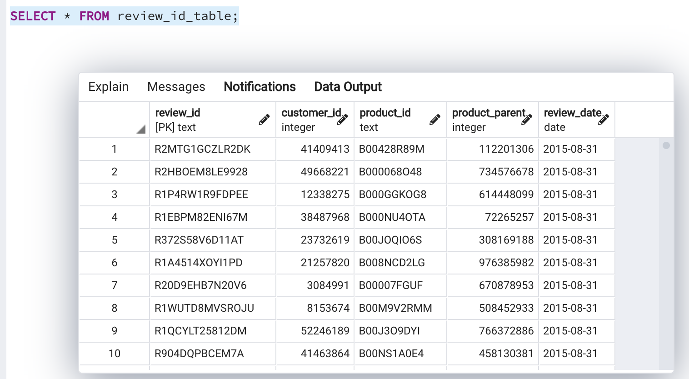

# Amazon_Vine_Analysis Chalenge

# Overview 

Using different technologies, such as Amazon RDS and s3, Google Colab, and PostgreSQL we analyze the Electronic product category reviews of Amazon.com 

## Purpose 

Analyze the reviews of Vine program and regular customers
## Results

The 42 % of the reviews of the customers of Vine Program were 5 stars 
